A MATLAB program called project.m to find the mesh currents in purely resistive DC circuits with independent voltage sources only.

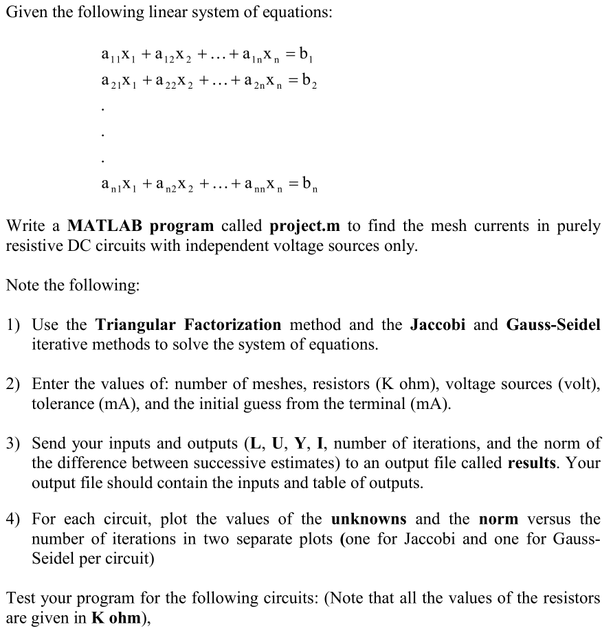

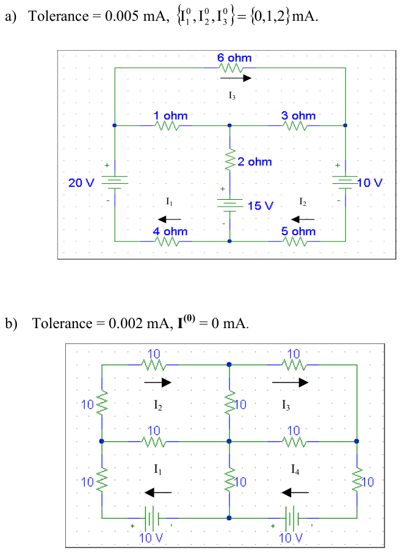

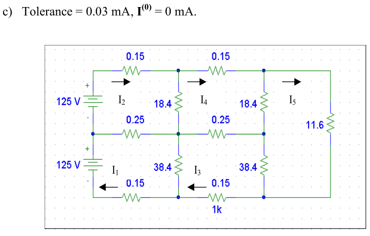

# Output Files

**The Output File of Circuit (1):**

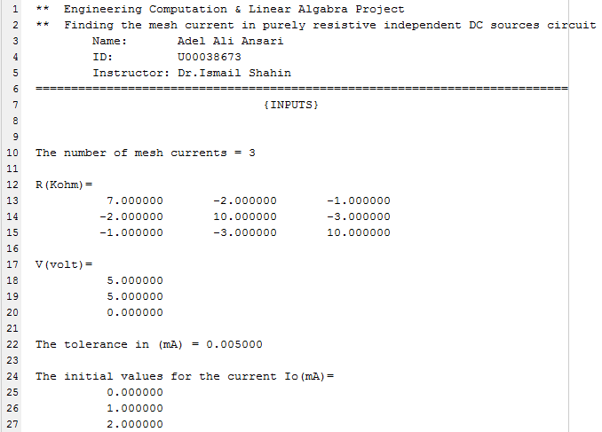

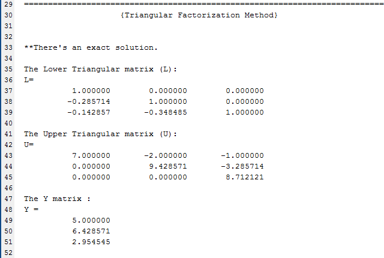

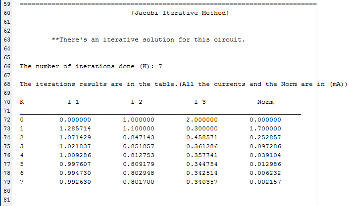

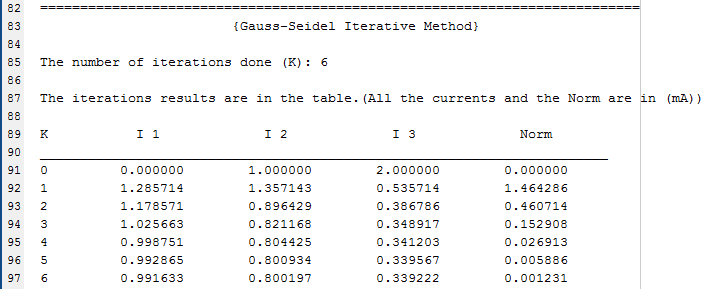

**The Plots of Circuit (1):**

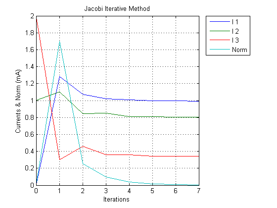

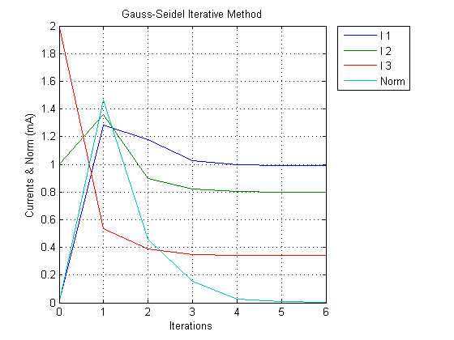

**The Output File of Circuit (2):**

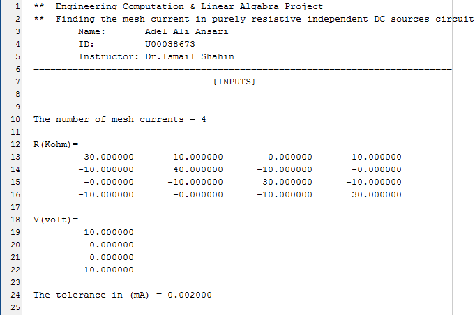

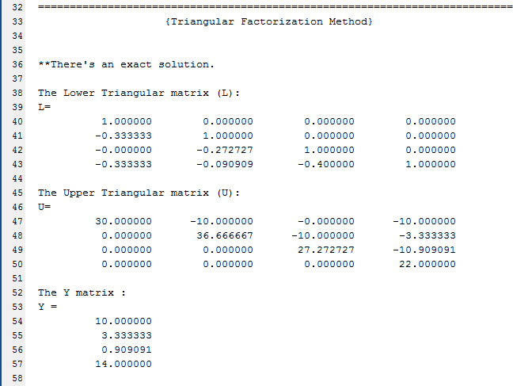

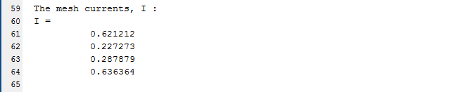

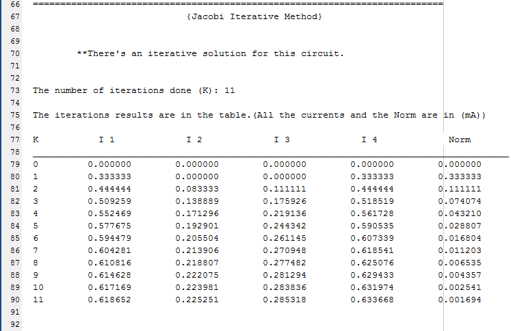

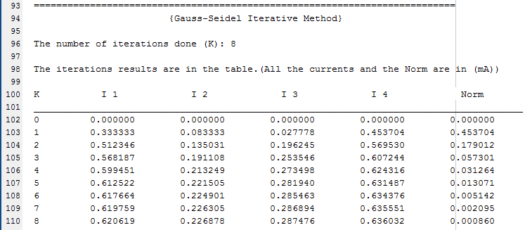

**The Plots of Circuit (2):**

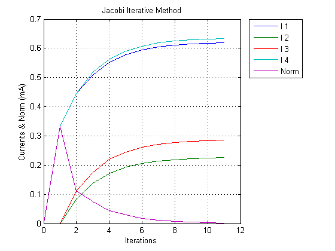

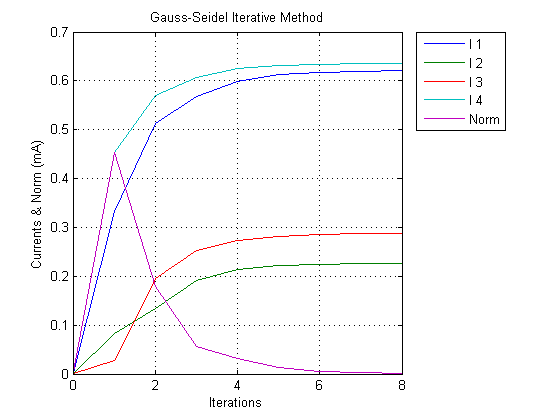

**The Output File of Circuit (3):**

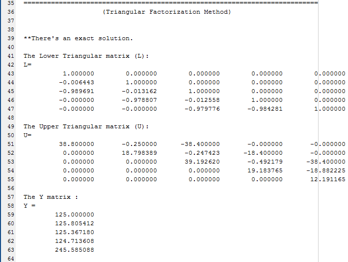

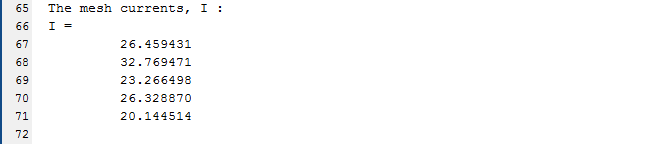

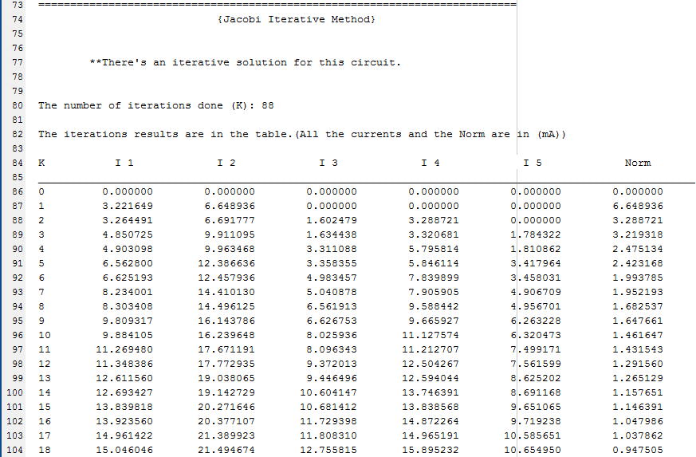

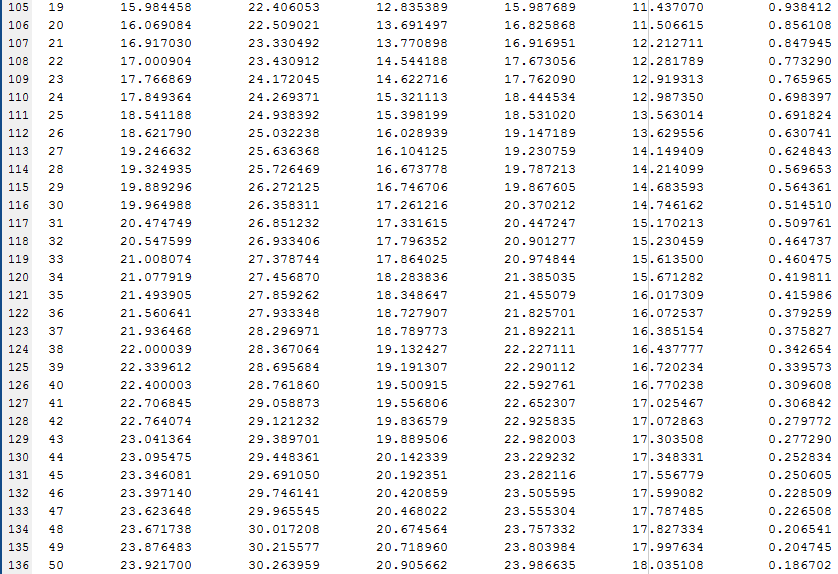

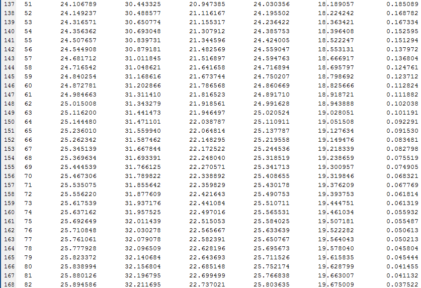

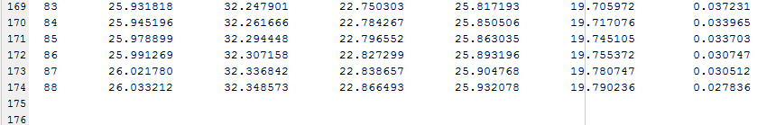

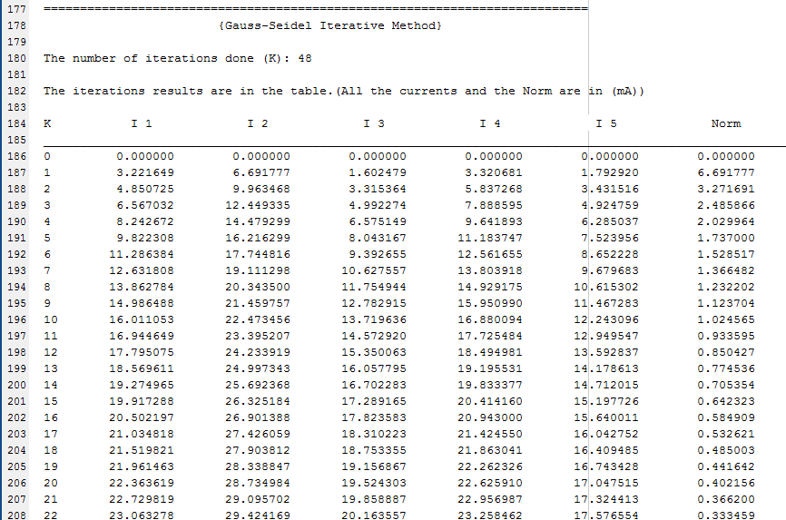

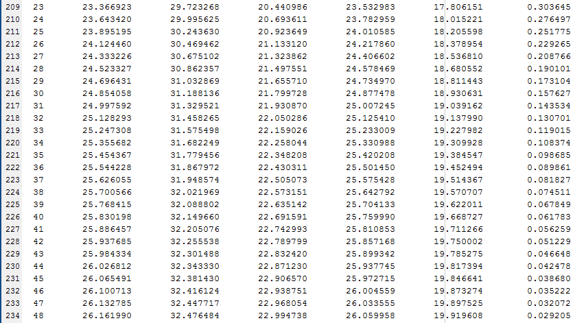

**The Plots of Circuit (3):**

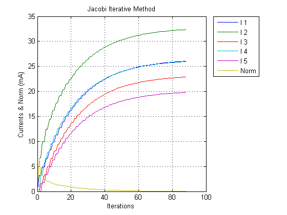

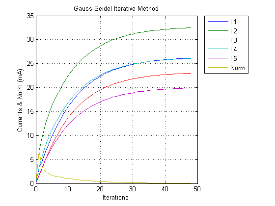

