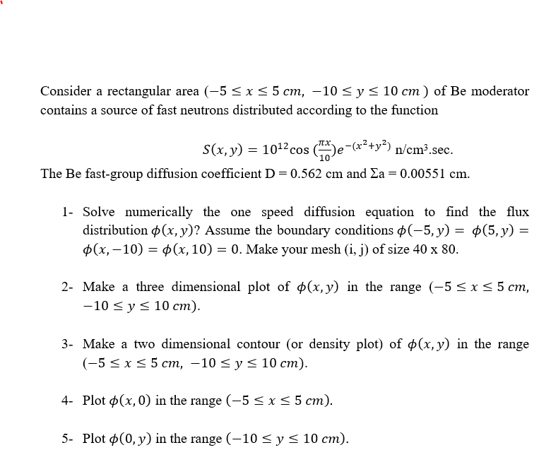
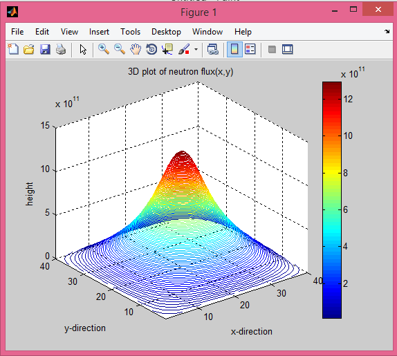
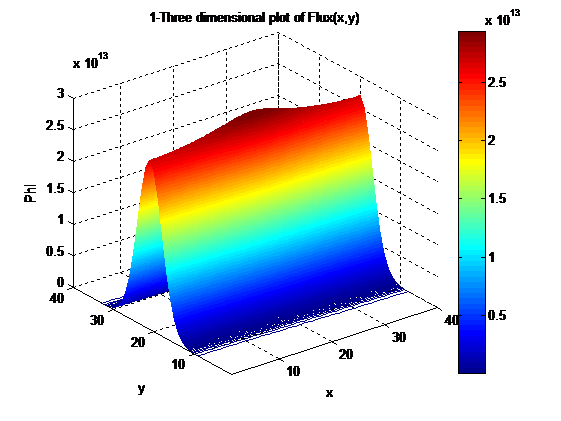
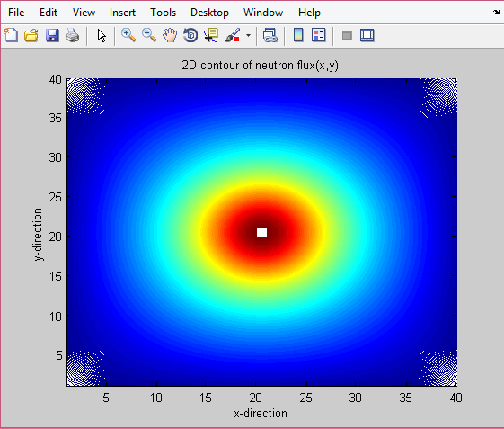
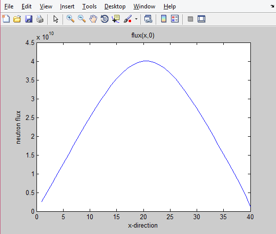
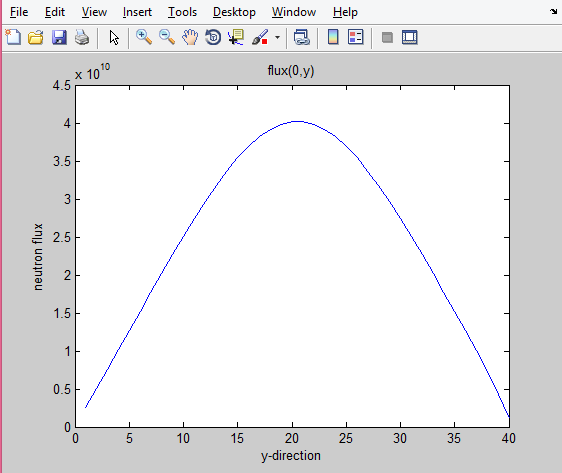

Numerical solution of the one speed diffusion equation to find the flux distribution

# Problem statement
The attached code named "fluxdistribution.m" in the repository is written to solve the following problems:

# Output figures for the questions:

**Problems 2**

**Problem 3**

**Problem 4**

**Problem 5**

