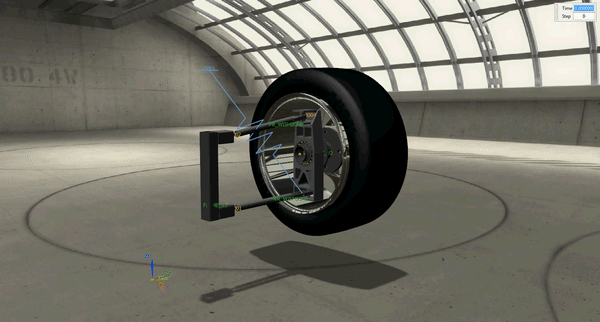
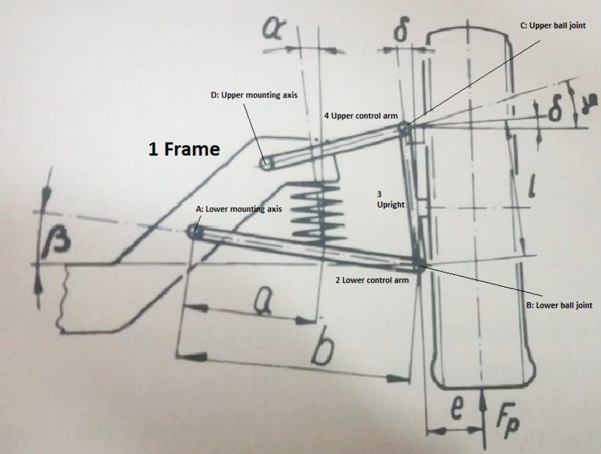
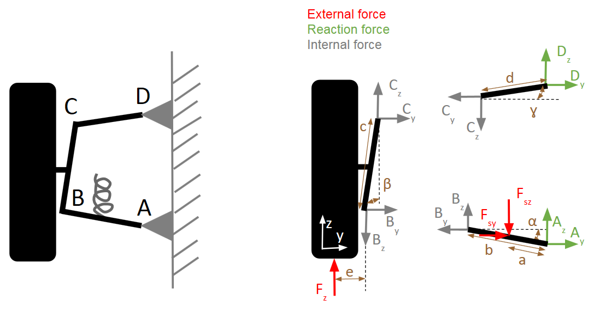
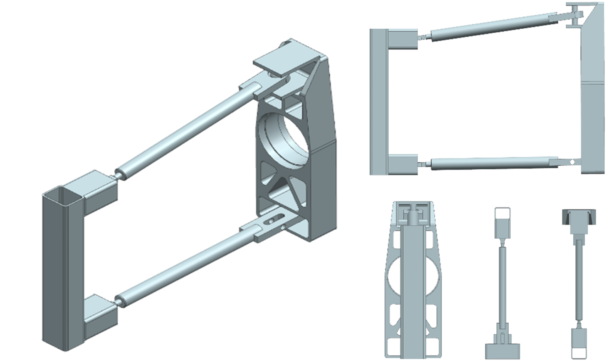
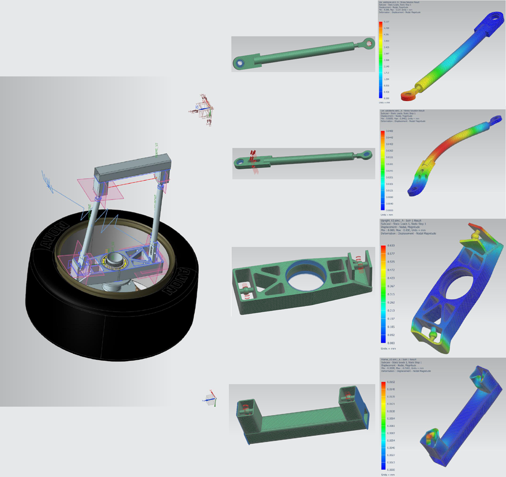
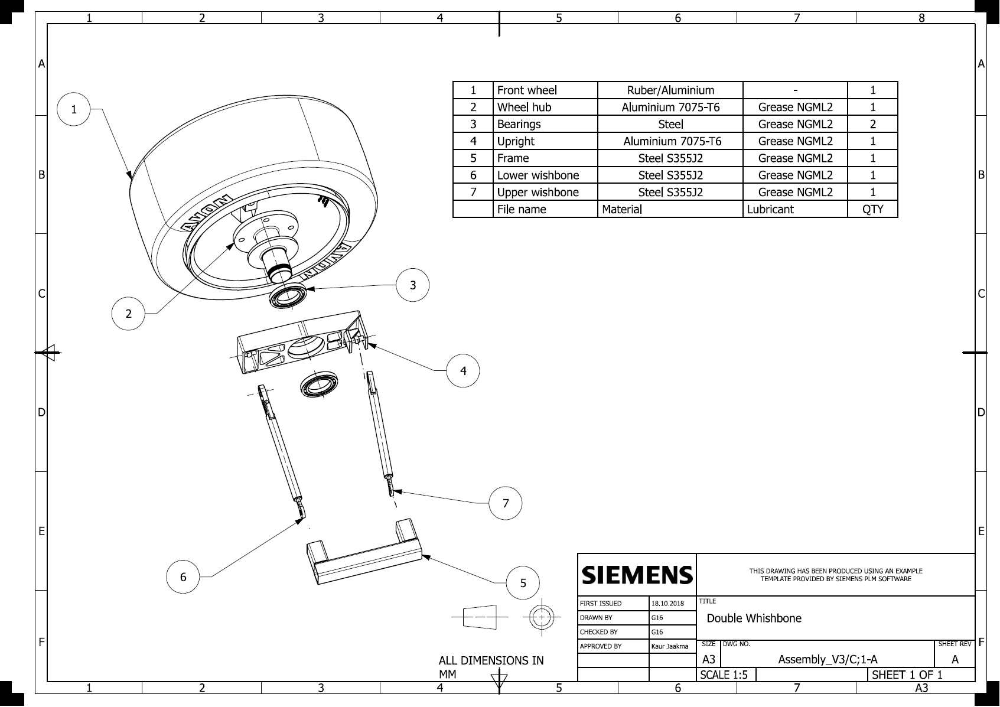

Connecting the wheels and tires to the car is a simple concept, but doing it in a manner which obtains good performance is a different matter altogether. In traveling around the circuit, the car experiences bumps from the track surface, and weight transfers from braking, accelerating, and cornering, and the design of the suspension geometry (relative angles and lengths) determines how the vehicle reacts to these forces. It has been a topic of interest to control vehicles and allow the wheels to move, adjust, and adapt to quickly changing road and driving conditions.
In this project, the aim was to design the front wheel suspension kinematics and components for a Formula Student race car with two different mechanisms (Double wishbone and McPherson suspension systems). The objective from the point view of kinematics is to design the linkage that fully determines the wheel path in specified manner when the wheel is having a vertical motion relative to the frame of car

In this project, the following areas were covered:

1. Selection of concept based on MBS, FEM and Requirements
2. Machine components and materials
3. Lifetime calculation
4. Geometrical rendering
5. Evaluating the requirements
6. Description of the design process
7. FEA result comparison with estimated values of deflections and stresses
8. Cost estimate
9. Bill of Materials

## Figures

Double wishbone system sketch:

Free body diagram for links of double wishbone system:

Double Whishbone mechanism, First angle projection rule:

Double Whishbone mechanism, First angle projection rule:

Bill of Materials (BOM):

### Full report:

<form method="" action="Images/Detailed Design Report_G16_UPDATED.pdf">
<button class="btn success"> View Report PDF </button>
</form>
