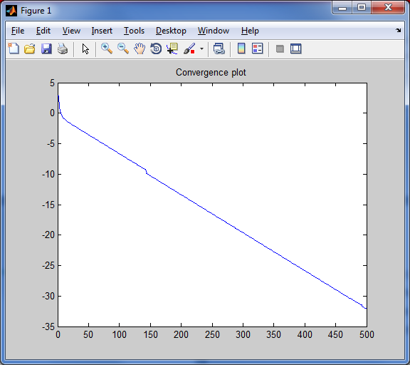
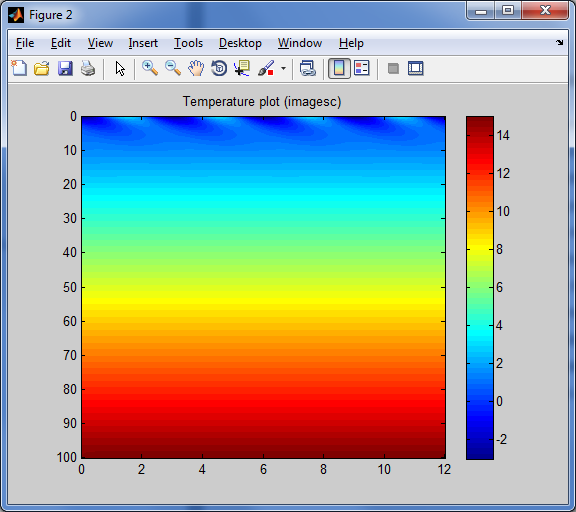
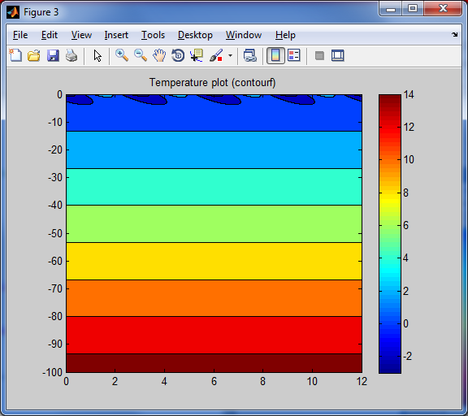
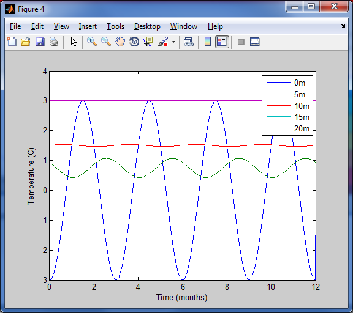

Script to solve the heat equation in soil with seasonal temperature forcing

Heat equation is a partial differential equation. Its solution gives the distribution of temperature in a region as a function of space and time when the temperature at the boundaries, the initial distribution of temperature, and the physical properties of the medium are specified. In this project, our aim is to numerically observe the heat diffusion in a piece of land up to a depth of 100 meters, and a time period of 1 year (1 year is ideal, since the 4 yearly seasons will guarantee that the temperature will go back to its original value yearly). We will implement the numerical solution in the computing environment of the software known as MATLAB. We also aim to derive the heat equation analytically. Finally, we will present a model-problem related to our field of study (Nuclear engineering), which relies on the heat equation.

# Numerical analysis:
In order to inspect the phenomena of heat diffusion, we implemented the following code in MATLAB with our given Initial Condition of:

```math
IC∶ u(x,0)= (-3)*cos⁡((8*π*x)/L)
```
As well as the two boundary conditions:
```math
BC_1 ∶ u_x (0,t)=zero
BC_2 ∶u(L,t)=zero
```
A MATLAB code was implemented to solve the heat equation as shown in heat_equation_num.m

# Outputs

The 4 output results were as follows:

<p align="center">

</p>

<p align="center">

</p>

<p align="center">

</p>

<p align="center">

</p>

The  amplitude of the temperate was converging to zero with increasing depth, which is an expected result.

# Conclusion
To sum up, the heat equation is an undeniable asset in analyzing how heat diffuses in various applications. It can be derived with the help of differential equations, however the practical calculation can be lengthy, and the assistance of a computer software to perform the heat simulation is unquestionably needed. Similarly to any other engineering concept, heat tends to find convergence, and it usually does once it starts repeating cycles, such as the 4 yearly seasons.
