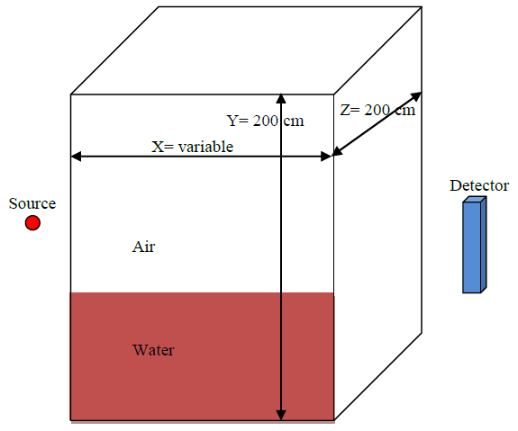
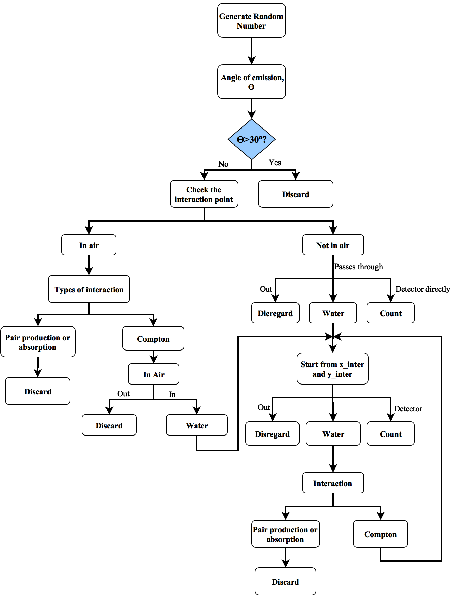
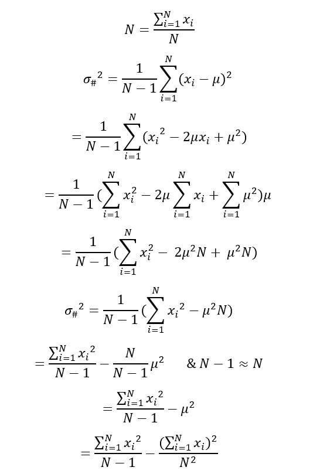
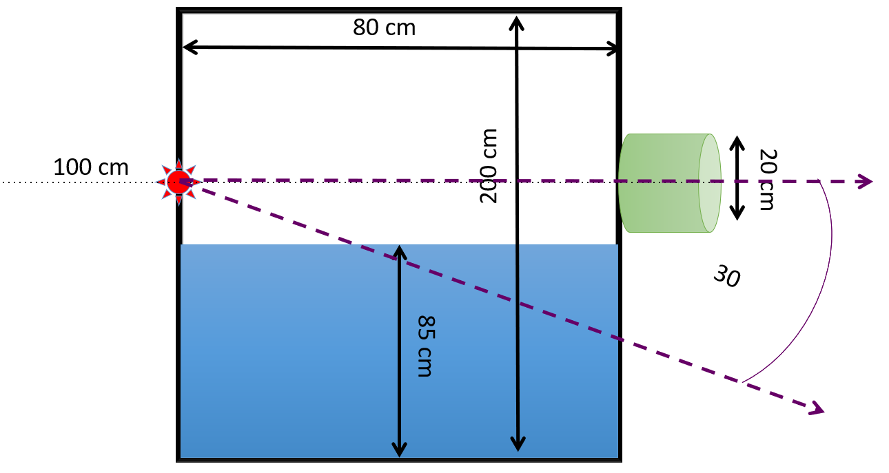
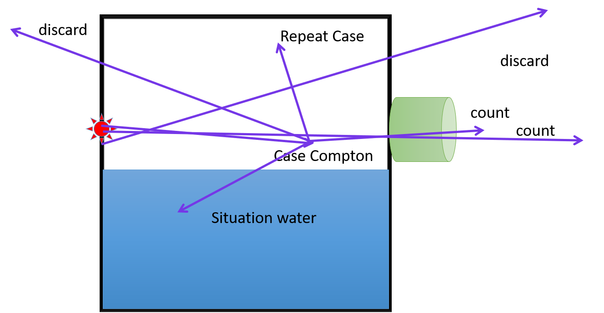
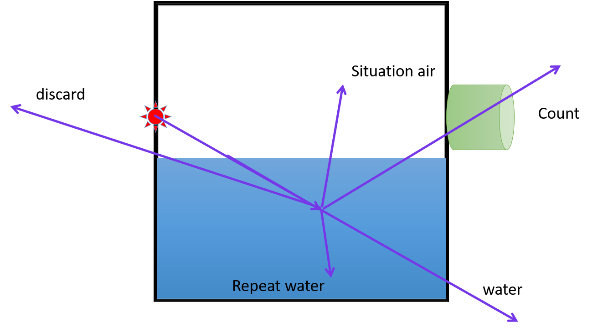
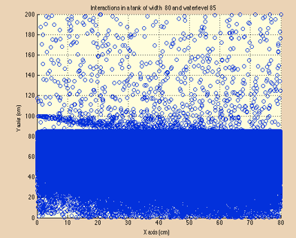
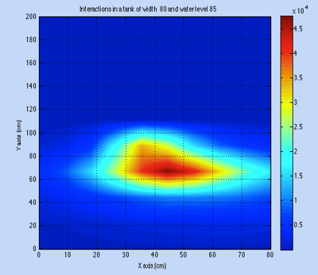
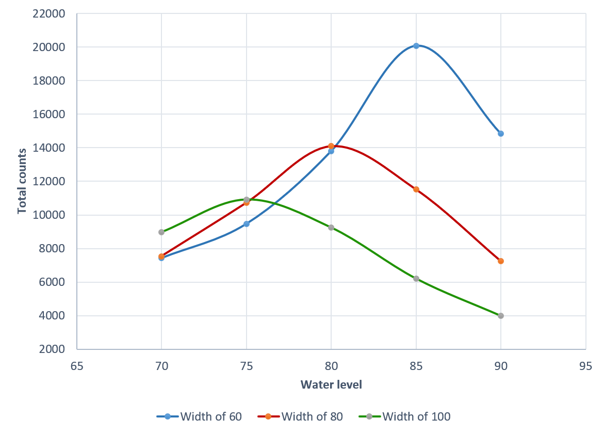

<form method="" action="https://github.com/adelansari/Level-Range-Gauge">
<button class="btn success"> View the Project on GitHub </button>
</form>

Monte Carlo Simulation of a Level Range Gauge

# Abstract
In this project, a method used for determination of level inside a closed boundary with defined geometry; a tank. Monte Carlo method has been implemented using MATLAB that simulates the gamma ray transport in two dimensions in order to predict the response of a continuous level gauge. The gauge is simulated as a tank with varying width (x). There are two mediums inside the tank; water and air. The program predicts the detector response for a tank in case of different water level and different widths.

Nuclear or nucleonic level gauge, also referred to as gamma level measurement is the technique which has been in use to monitor or control the level of material in tanks in the refining and chemical industries. They are usually applied in fields where all other level measurement techniques fail to work owing to their capability of working with hazardous situations. In this method, energy needed for level measurement is emitted arbitrarily by radio isotopes in the form of bursts.
A nuclear level gauge basically includes following components:
1.	A source of gamma radiations
2.	A detector

In this project, the proposed design used for detection setup is as follow:

The tank has rectangular shape with dimensions x= variable, y=200 cm and z= 200 cm. The source that was used is Cs-137 (it can vary depending on the type of material in the tank). This source was specifically chosen as it has single peak it its spectrum. The collimated source with dispersion angle of 30o is placed in: x=0, y=100 cm and z=100 cm. The detector has the following dimensions: x= 3 cm, y=20 cm and is placed between 100 and 120. Detector top center coordinates are specified as: x=tank width, y=110 cm and z= 100 cm. There are two mediums in the tank: Water and Air considering the water level to be variable.

The objective of using Monte Carlo (MC) simulation technique in this project is to study gamma ray emission and interaction in two dimension in the mediums inside the tank. Level gauging depends on the detector response. As the water level rises and approach the detector height, the number of particles reaching the detector will decrease and hence it gives an indication that water needs to be stopped from rising. MC helps to generate random numbers by first showing the emission angle in the random set, theta= cos(1-2*rand)^-1. We can then determine the position of interaction using x= -1/mu_air * ln(rand). It then determines the interaction medium and anticipate different type of gamma interactions such as: Compton scattering, photo electric effect and pair production. In case of Compton scattering, the following things will be calculated:
•	The scattering angle
•	The new energy
•	The new attenuation coefficient
If the emitted particle exits the tank, there will be no count. In case of the particle interacting with the detector, the MC code will count for the detector efficiency and counts the detected particle. Usually the particles emitted directly to the detector will be counted.

# Algorithm

Standard deviation analysis (Error analysis) was performed, the final equation was derived using the following:

Including the efficiency of detector through error propagation:

# Examples:

# Results:

The code was used to get results for the tank width of 60,80 and 100 cm and a water level of 70,75,80,85 and 90 cm. The total number of runs performed per results was 1 million iterations.

**Scatter map**
Example: width 80, water level 85

**Heat map**
Example: width 80, water level 85

The data was analyzed and the trend was turned into the following graph:

As we could see from the data, we would recommend a tank width of 60 as it is the most sensitive to changes and allows has a more constant increasing response for most of the water level range. With the note that a tank width of 100 would have the least counts due to direct and air interactions, and hence have a more contribution from the water scattered but the range of solid angle that reaches the water also decreases
The reason for the change this trend is as the water level increase above a certain level that depends on the width, the water absorption starts to take effect and the neutrons that have an interaction in water deep water has a lower probability of reaching the detector. As the width of the tank increases the counts decrease as the angle range that leads to a direct detector count decreases. For every width there is a certain minimum water level below which the neutrons don’t interact with the water.
