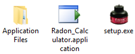
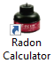
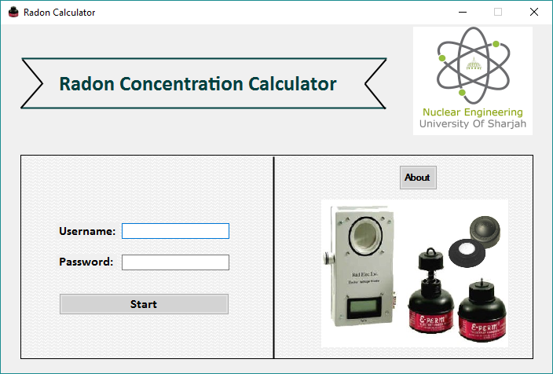
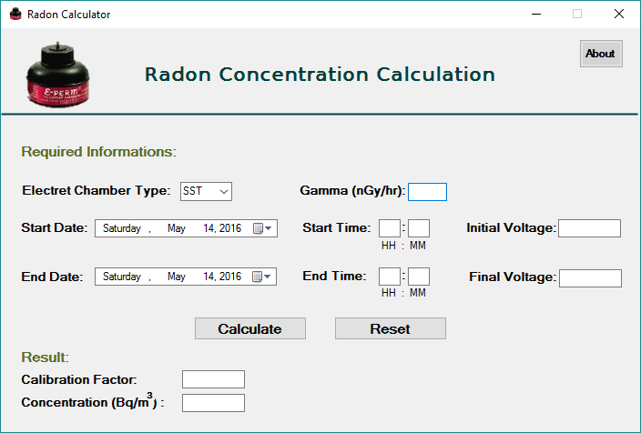

## Overview:
The Radon Calculator software was designed in order to calculate the radon concentration in Bq/m3 using Rad Elec E-PERM equipment. The software was developed using Microsoft Visual Basic. Visual Basic is a simple way to create programs for Microsoft Windows that uses “Beginners All-Purpose Symbolic Instruction Code” programming language. It is easier to create an application or a graphical user interface using the components provided in the software. An executable setup file was generated so that any user can use the “Radon Calculator” software in his/her computer after installation. The main reasons of making this software are:
1.	The company software is “Radon Report Manager” and it cost $200. Buying the software wasn’t necessary as the company already provided us with a manual of how to use the Red Elec equipment and the equations needed to find the concentration of radon. Furthermore, all the equations and the constants were used in “Radon Calculator” to ease our calculation.
2.	Inputting the time in “Radon Report Manager” software takes time as the user needs to repeatedly press the right bottom in order to set the time. For instance, in order to input 32 seconds in the software, an individual need to right click 32 times. This problem was solved in the “Radon Calculator” software where the user is asked to enter the time manually in 24 hours format.

## Computer Requirements:
Microsoft Windows® Operating System for XP, Vista, Windows 7, Windows 8, and Windows 10.
The softwate has the following files inside it:

In order to install the software, the user should double-click on the “setup” icon.
The following windows will appear. By clicking on the “Install” button, Radon Calculator will be installed and a shortcut of the program will appear in the Desktop.

Below is what will open after the installation is complete:

This is the main menu which asks the user to enter the username and password to be able to access the calculator form.
After entering the username and password correctly, the first windows will close and the calculator windows will show up.

By inputting the required data and choosing the start date and end date, the software now is able to calculate the concentration of Radon gas after pushing the “Calculate” button.
Features:
The developed software does not only perform calculation; it also shows an error windows if any. Here is a list of the errors messages it can show:
•	Incorrect Credentials (in case of wrong username or password entry)
•	Spaces not allowed
•	All values must be positive
•	The timestamps must be in 24 hour format.
•	The timestamps must be a period of time of 60 minutes.
•	The input entered is not a numeric value.
