Use a variety of reactivity measurement techniques to actually measure reactivity levels and reactivity changes in a real reactor.

# Documentation:

The purpose is to become familiar with different reactivity measurement techniques that are used to predict the expected change in reactivity by determining the worth of control components per reactor configuration.
Initially the UMLRR was on steady state at 500 W for several minutes while RegBlade was in Auto Mode.

The four phases of of operation can be formalized as follow:

**Critical Operation:**
- Phase 1: Small reactivity changes from critical (asymptotic period technique)
  - Positive &rho;: Switch the regblade mode from auto to manual and withdraw it about 3 inches. After waiting for the reactor to 5 kW, switch the regblade to auto mode to stabilize the reactor at that power.
  - Negative &rho;: Switch the regblade to manual mode and ramp in the regblade about 4.5 inches into the core. Let the power decreases to about from 5 kW to 500 W. Then, set the regblade to auto to let the power stabilize at the new level.
- Phase 2: Blade drop method
  - Insert the startup source into the core while being in auto mode and wait till the reactor stabilizes. This step will help in studying the worth of the startup source for later use.
  - Next, switch the regblade to manual mode and drop the blade of interest (blade 1 in this lab) into the core by re-attaching the blade drive mechanism to go into the subcritical state. Once the startup counter stabilized, proceed to phase 3.

**Subcritical Operation:**
- Phase 3: Subcritical reactivity change (positive &rho;)
  - Withdraw the blade of interest (blade#1) to a maximum of 2 inches below its initial height (15 inches was withdrawn in the lab).
  - Once the startup counter reached an average equilibrium, proceed to the next phase.
- Phase 4: Source Jerk Method
  - Remove the startup source and wait and monitor the sub criticality with the startup counter.
	Once the system stabilizes, wait for some time and save the history file and follow the reactor shutdown checklist.

## Stable Period Method
Processes the data from the Phase I tests and use the Stable Period Method to determine the amount of reactivity inserted for both the positive and negative reactivity transients that were performed.

**Phase 1: Positive ρ**
A reduced data file ```Problem2_positive.dat``` was created using UMLRR GUI. I wrote a code ```Problem2_positive.m``` that generates various plots for the specified region.

<p align="center">
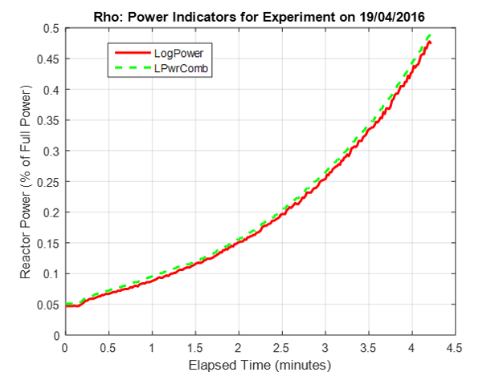
</p>

<p align="center">

</p>

<p align="center">
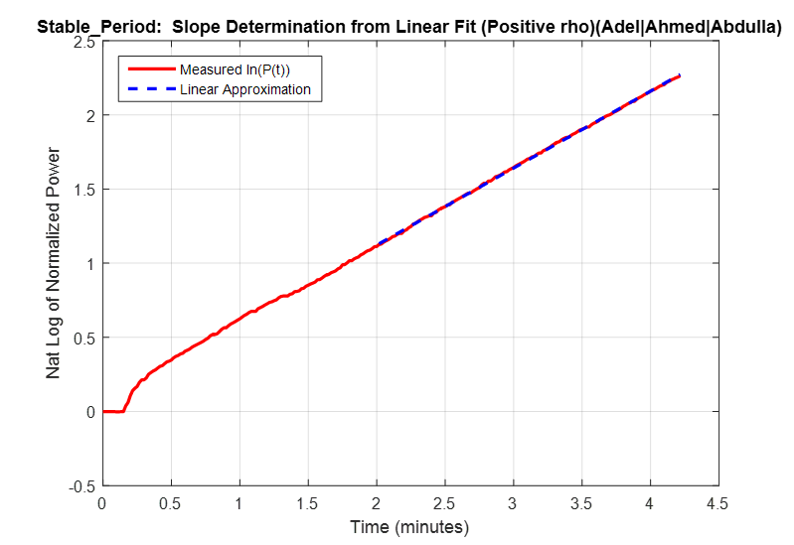
</p>


According to the result generated in the command windows:

Total reactivity change (\$) = ρ<sub>1</sub> - ρ<sub>0</sub> = \$0.0858 - \$0 = \$0.0858

Regblade was withdrawn from 10.41 inches to 13.47 inches as shown below:

<p align="center">
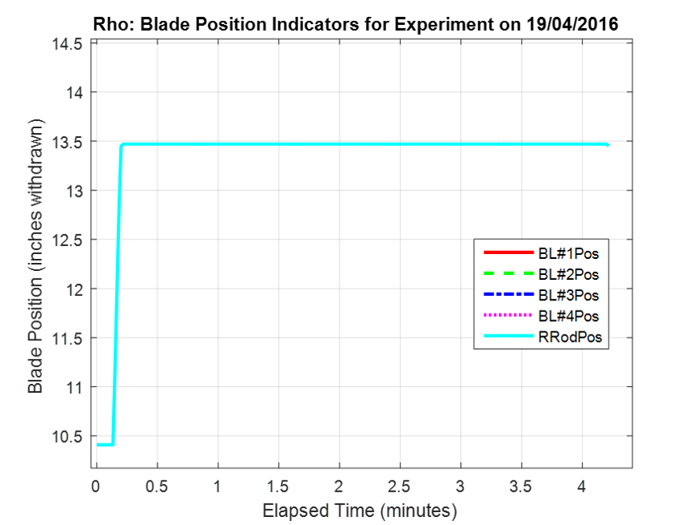
</p>

<p align="center">
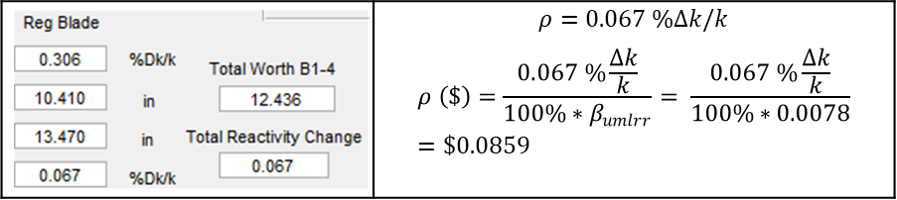
</p>

The measured ρ obtained from the real experiment and calculated using the code written in Matlab (\$0.0858)  is almost the same as the one calculated from the blade_worth_curve.p (\$0.0859). The very small change is believed to be caused by the different change in total reactivity per inch due to the fuel consumption. Effects of feedback might have caused the small difference as it was not present in the experiment (feedback is important at 10 kW). However, the blade worth curve might have included the feedback effect.

**Phase 2: Negative ρ**

<p align="center">
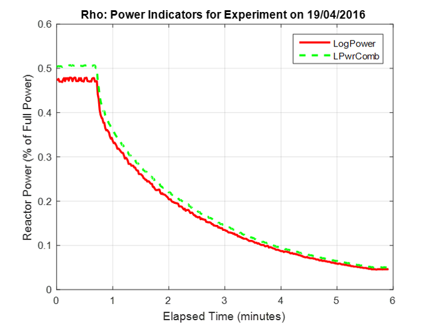
</p>

<p align="center">
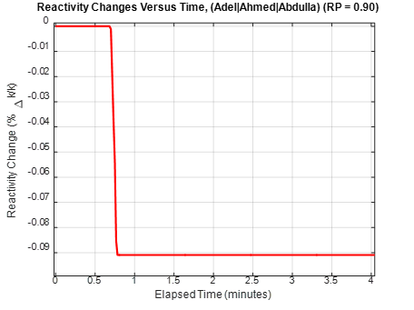
</p>

<p align="center">
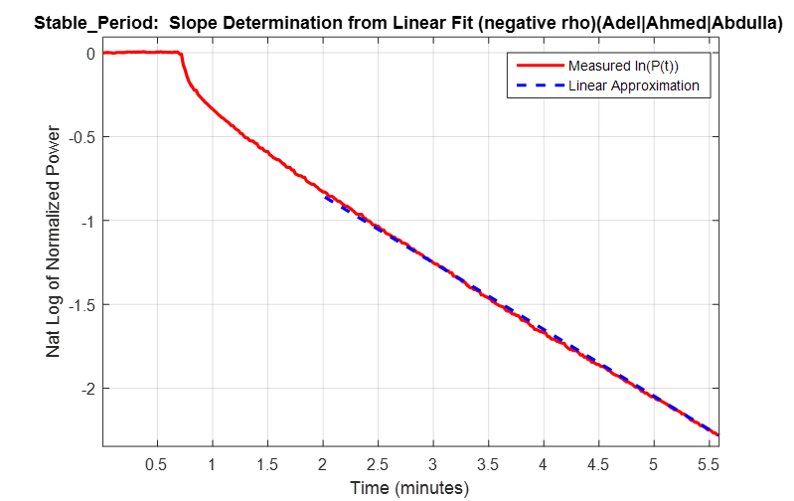
</p>

According to the result generated in the command windows:

Total reactivity change (\$) = ρ<sub>1</sub> - ρ<sub>0</sub> = -\$0.1187 - \$0 = - \$0.1187

Regblade was withdrawn from 10.630 inches to 6.168 inches as shown below:

<p align="center">
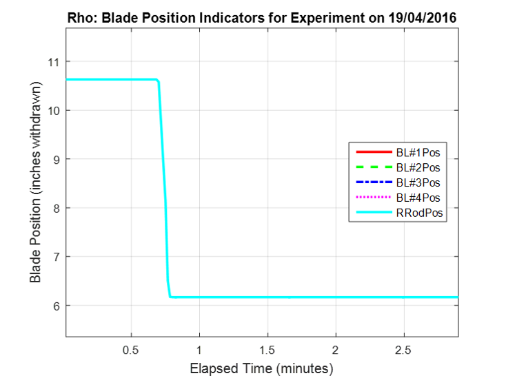
</p>

<p align="center">
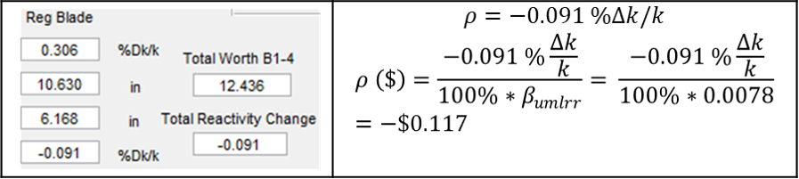
</p>

## Startup Source Insertion

Here I will start to estimate the reactivity worth associate with the insertion of the startup source at the beginning of the Phase II test.

The fission source dominates the external source in terms of fission production and hence the negative reactivity reflected is larger than the positive reactivity insertion.
By putting the source in, some of the water reflector will be removed which represents a negative reactivity. In order for the reactor to stay essentially critical, the regblade will come out a little.

<p align="center">
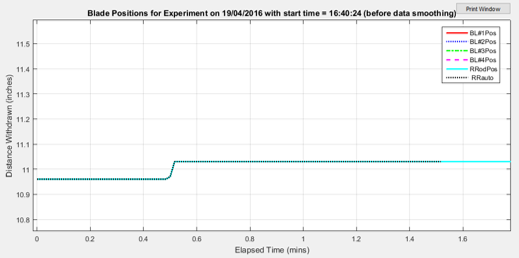
</p>

Insertion of startup source added negative reactivity. Since the regblade is in automode, it will try to maintain constant power by withdrawing the regblade. The total reactivity change by taking into account the initial position of the blade and final position are found as shown below:

Regblade was withdrawn from 10.96 inches to 11.03 inches.

<p align="center">
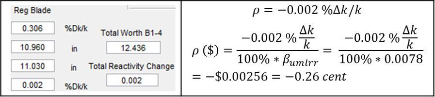
</p>

The value is very small since the start-up source is only effective in the subcritical region.
The negative was added because the start-up source is opposite in magnitude to that of the compensation movement of the regulating blade.

## Rod Drop Method

Here I estimate the amount of reactivity inserted when Blade #1 was dropped into the core.

<p align="center">
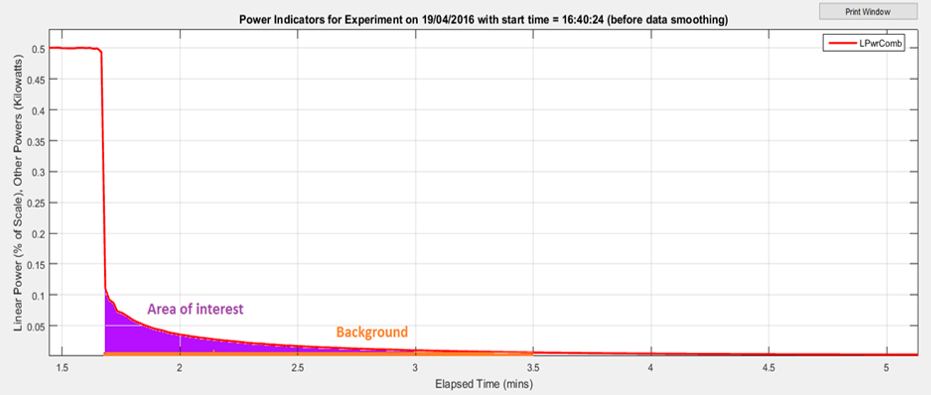
</p>

The reactivity can be estimated by integrating the area under the power curve and subtracting the background from it.
By loading ```Problem4.dat``` data file in ```Problem4.m``` code, the following plots and output was obtained:

<p align="center">
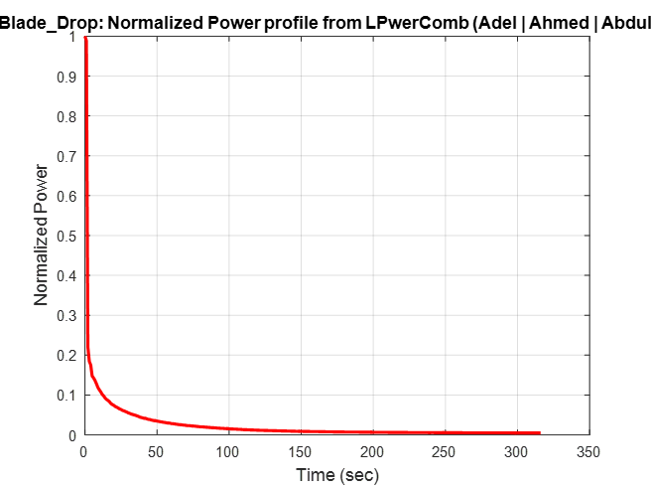
</p>

<p align="center">
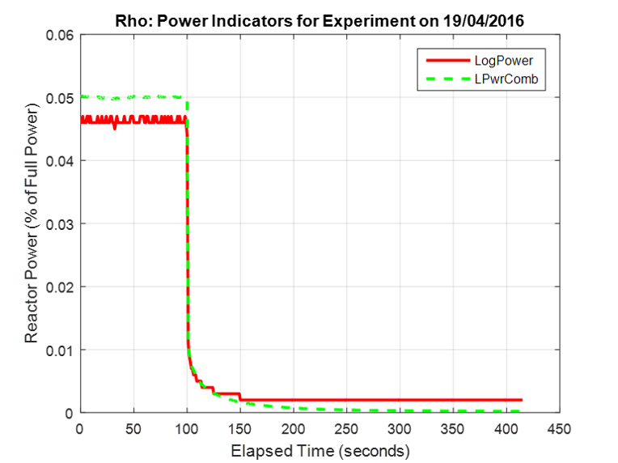
</p>

<p align="center">
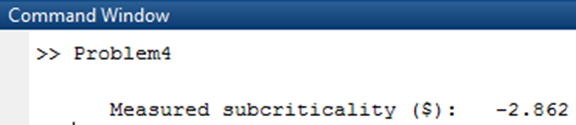
</p>

Using the blade worth curve:
Blade 1 was withdrawn from 16.95 inches to 0.

<p align="center">
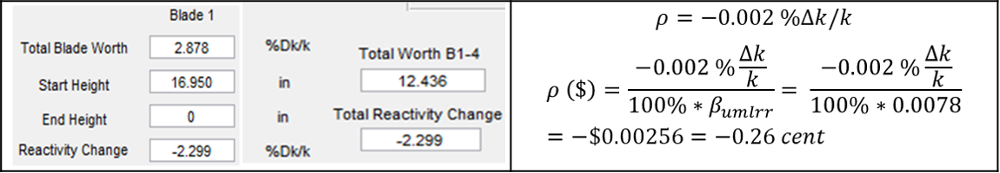
</p>

The reactivity obtained are close to each other. The small difference is due to the error in specifying the region of interest in the data file. Furthermore, the fuel depletion plays a rule here since the blade curves were produced on Jan, 2016.

## Subcritical Multiplication Factor Method

Here I estimate the worth associated with the Phase III test using an estimate for the subcriticality level prior to the reactivity change from the Phase II tests.

<p align="center">
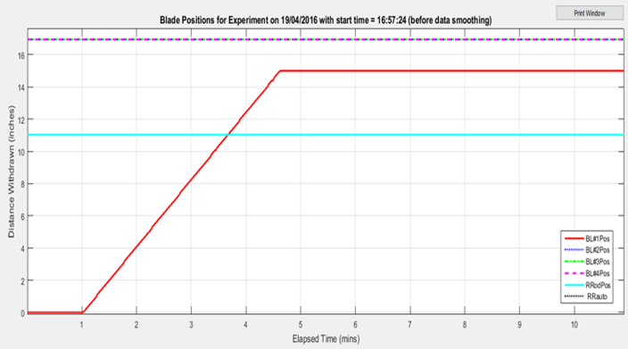
</p>

<p align="center">
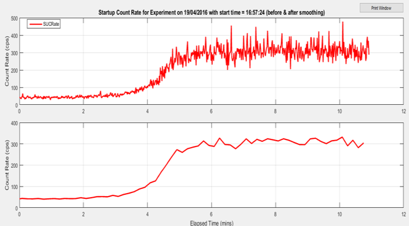
</p>

In this part, the reactor operator withdrew blade#1 from 0 to 15 inches (~2 inches away from the initial critical height of 16.95). The initial count rate (C<sub>0</sub>) was ~42 cps. After the ramp change and waiting sufficient time for the reactor to stabilize, the final count rate (C<sub>1</sub>) reached ~320 cps.

<p align="center"></p>

<p align="center"></p>

**Analytical:**

<p align="center"></p>

Using the **blade worth curve**:
Blade 1 was withdrawn from 0 to 15 inches.

<p align="center">
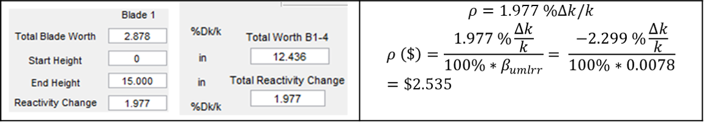
</p>

**Numerical:**
Using the matlab code ```Problem5.m``` that was written to calculate the measured &Delta;&rho;:

<p align="center">
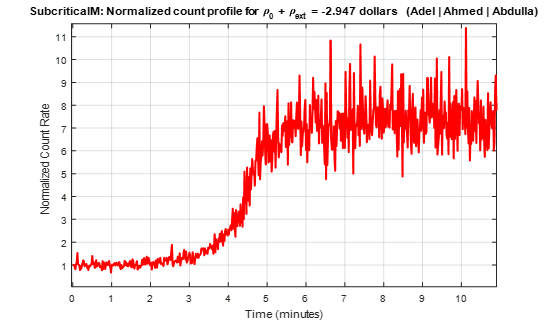
</p>

<p align="center">
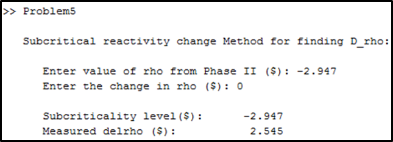
</p>

&Delta;&rho;=\$2.545

To wrap up:

Method             | (\$) &Delta;&rho;  
------------------ | -------------------
Analytical | 2.56
Blade worth curve | 2.535
Matlab (numerical) | 2.545

The reactivity obtained from the 3 above methods were similar to each other which shows that our approach to measure the change in reactivity was correct.

##  Source Jerk Method

In this section, I will try to estimate the subcriticality level at the beginning of the Phase IV sequence.
In phase 4, we are going to use the following expression to measure the subcriticality level:

<p align="center"></p>

Where:
- t<sub>d</sub> is obtained from the kinetics data
- T<sub>0-</sub>  (first value in the pmnorm array)
- T(t)dt (calculated using trapz function).

The following expression will be used in our calculations:

<p align="center"></p>

<p align="center">
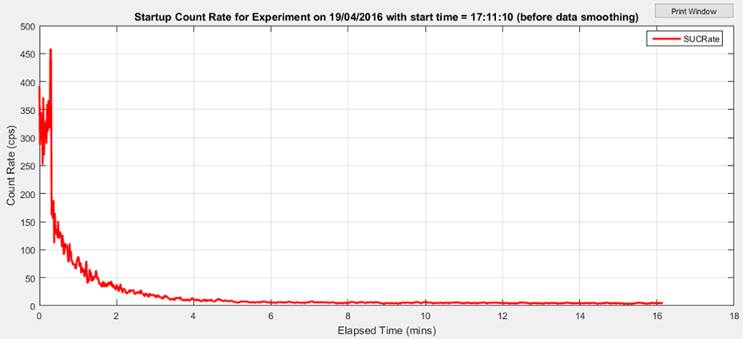
</p>

C<sub>0</sub>=C<sub>1</sub> from phase 3 = 320 cps

**Analytical solution:**

From phase 3:

<p align="center"></p>

Sub criticality level:

<p align="center"></p>

Using **blade worth curve**:

<p align="center">
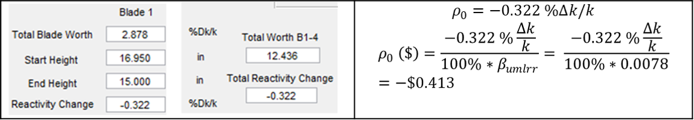
</p>

**Numerical solution:**
Using the code ```Problem6.m``` prepared in matlab to solve this part:

<p align="center">
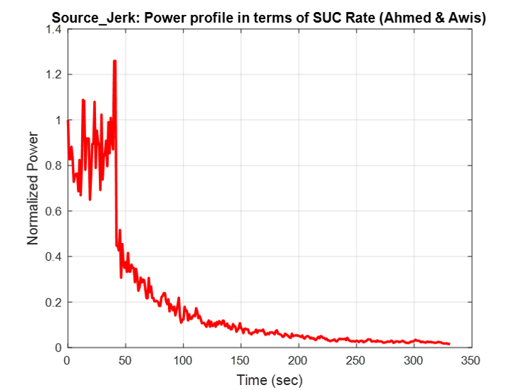
</p>

<p align="center">
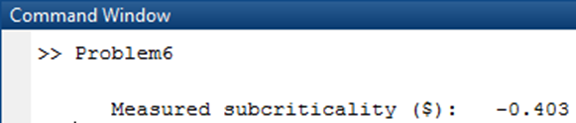
</p>

The graph associated with removing the startup source has a decreasing trend as expected.

To wrap up:

Method             | (\$) &Delta;&rho;  
------------------ | -------------------
Analytical | -0.402
Blade worth curve | -0.413
Matlab (numerical) | -0.403

The reactivity obtained from the 3 above methods were similar to each other which shows that our approach to measure the change in reactivity was correct.
