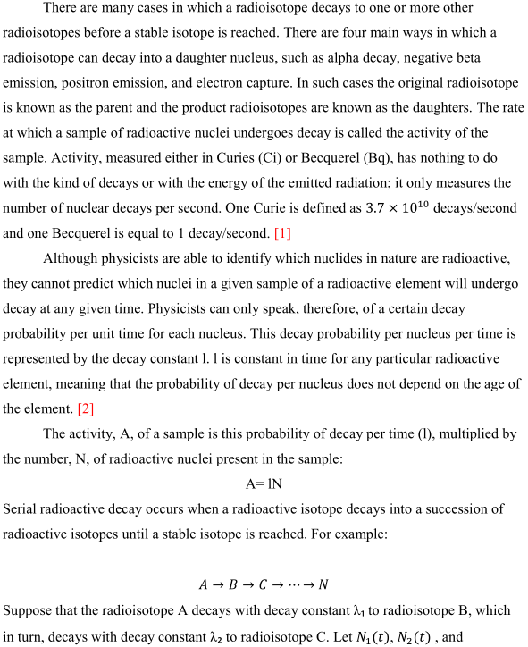
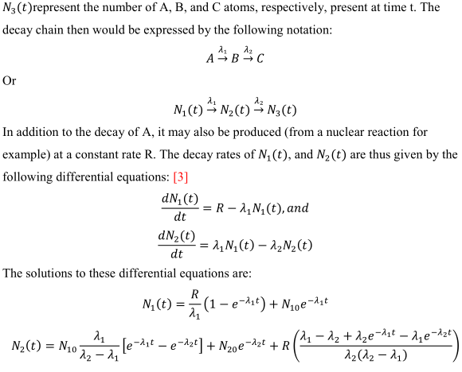
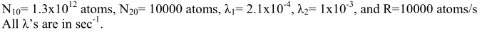
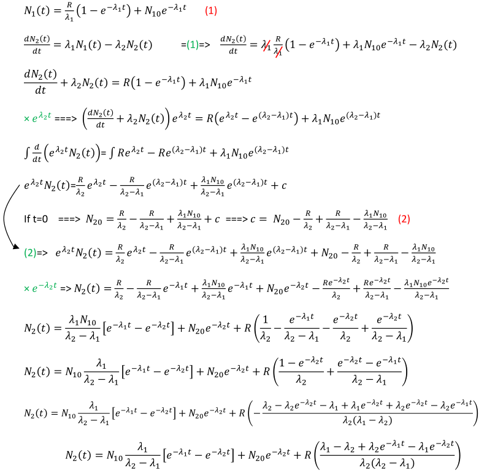
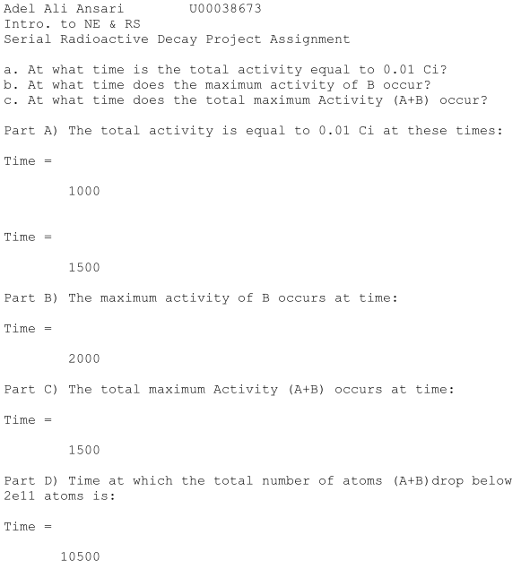

<form method="" action="https://github.com/adelansari/Serial-Radioactive-Decay">
<button class="btn success"> View the Project on GitHub </button>
</form>

Radioactive isotopes decay exponentially until they reach a state where no more decay takes place. This Matlab code will calculate the activity or number of atoms in a given time until they reach their final state.
After experimenting, I concluded the total decay time may depend on the individual decay times of each isotope.

# Introduction

# Case Study

# Derived Equation

# Output

# References:
1. Tim Madden and Amy Street, “Think Before You Shower”.
2. K.E. Holbert (2006), “RADIOACTIVE DECAY”
3. LAMARSH, “Introduction to Nuclear Engineering”.
